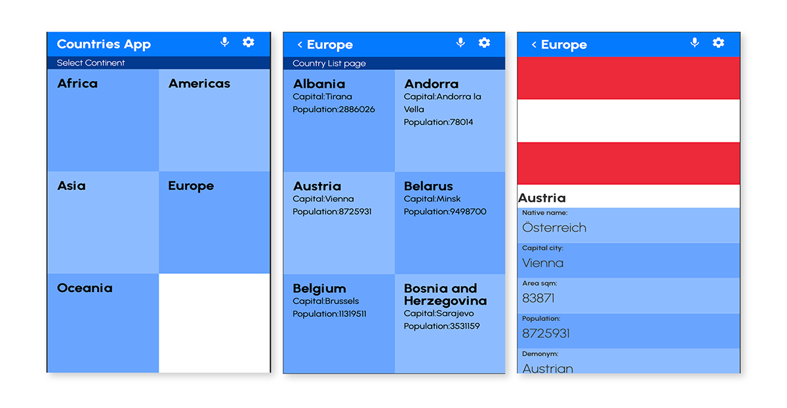

# React Capstone: World Countries

> This React capstone project is about building a mobile web application to check a list of Countries in Europe and gave users the ability to review details about each country. The web app was created by using React and Redux libraries.

## Built With

-Javascript
-CSS
-React and Redux

### Live Demo
[Live](https://marijanbrvar.github.io/countries-rest/)

### Presentation video
[Video](https://www.loom.com/share/755efe5569df4154b8b5700eb2bb52fa)

### Prerequisites
-Chrome browser
-Node v14.XX >
-npm (usually already installed with current node version)

### Getting Started
To get a local copy up and running, follow these simple example steps.
`git clone git@github.com:marijanbrvar/countries-rest.git && cd countries-rest`
`run npm install`
### Setup and Run
To run code locally, please follow steps belove
`run npm run start`
### Run tests
`npm run test`

## Authors

👤 MARIJAN BRVAR

- GitHub: [@githubhandle](https://github.com/marijanbrvar)
- Twitter: [@twitterhandle](https://twitter.com/marijanbrvar)
- LinkedIn: [LinkedIn](https://linkedin.com/in/marijanbrvar)

## 🤝 Contributing

Contributions, issues, and feature requests are welcome!

Feel free to check the [issues page](../../issues/).

## Acknowledgments
- [NelsoSakwa](https://www.behance.net/sakwadesignstudio) For the design used to build this site.

## Show your support

Give a ⭐️ if you like this project!

## 📝 License

This project is [MIT](./MIT.md) licensed.
